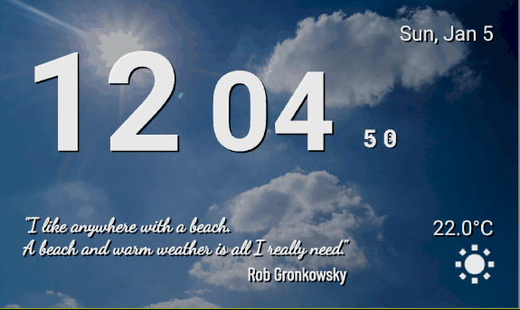

# Mood Clock

A clock for the Lenovo Smart Clock based on the weather mood. 
Shows background images and popular quotes based on the current weather conditions.

Features:
* Background images based on the weather conditions
* Popular quotes also based on the weather conditions
* Animated digital clock  
* Also shows date, current temperature and icon representing weather conditions

The clock is build using **[Flutter](http://flutter.dev)**.

Background images are taken from [Pexels](https://www.pexels.com/search/landscape/) 
which offers free to use images.

Contains free to use weather icons from https://www.iconfinder.com/Makoto_msk.

See Live-Demo on [project's homepage](https://irockel.github.io/flutter_clock).

Released as open source. For License, see [LICENSE](LICENSE) file.
